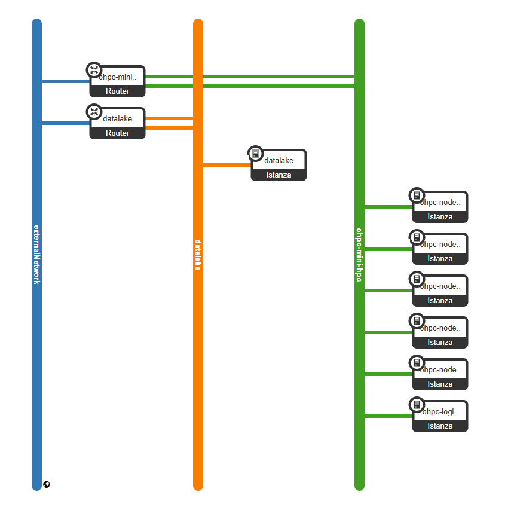

# AIND

Personalized Data-Driven Prevention of Neurodegenerative Disorders: A Datalake & Artificial Intelligence Approach

## Repository Description

This repository contains the code scripts for the AIND project, organized across different workpages. It is divided into three main folders, each corresponding to a specific workpage:

- **WP2**: Datalake Building
- **WP3**: Neurodegenerative Disease Modelling
- **WP4**: Predictive A.I. Algorithms

## Project Goals

### Primary Objective

Develop artificial intelligence personalized solutions as ‘proof-of-concepts’ to determine the individual risk in adult people of contracting neurodegenerative disorders (NDD), i.e., Parkinson’s or Alzheimer’s diseases, based on data derived from a multiscale health NDD Datalake built from available clinical databases, available disease models, and state-of-the-art predictive algorithms.

### Secondary Objectives

- **Data Accessibility**: Identify and make accessible for databasing reliable data and information regarding patients and scientific publications on Parkinson's Disease (PD) and/or Alzheimer's Disease (AD) in their early stages of disease progression.

- **Automatic Data Extraction**: Provide an initial ‘proof-of-concept’ for establishing an automatic data extraction process to obtain information from key clinical and scientific databases and keep the Datalake constantly updated.

- **Predictive Models for Precision Medicine**: Identify and operationalize the most up-to-date predictive/prognostic disease models to provide data to drive an initial training set for the precision medicine AI algorithms, as well as real data-driven comparators for validation.

# Data Lake Access Guide
This document provides instructions on how to access and use the data lake infrastructure developed by IFAB team.

## Data Lake structure

The Data Lake is composed by 7 Virtual Machines (VM) connected to the public network via 2 routers that controll the private networks and organize the comunication between the VMs. One router is connected to the Data Lake VM (orange), in this VM is installed Mongo DB which allows to have a Data Catalogue where all the file stored have specific metadata allowing for queries. The other 6 VMs (green) represent 5 Computing Nodes and 1 (the last in the graph) Login Node. 
The Login Node is the most important one since has multiple crucial roles in the usage of the Data Lake:
- **File storage**: to the login node is attached a Volume where is installed MinIO.  
- **Roles**: the division of the Login Node in roles allows for private and shared folders.
- **Job Launch**: via the Login Node is possible to launch jobs, see the job queue. (link to the section ffor job launching)

To upload, download fiels or make a query its necessary to interface with the DataLake, further inforamations are reported in the WP2 > dl_client > README (https://github.com/ifabfoundation/AIND/blob/main/WP-2/dl_client/README.md)

### MongoDB
...
### MinIO
MinIO is a software that allows to mirror the volume storage, which is tipically folder based, as an object storage allowing more efficent operations with the data.
...(acces to MinIO --> da menzionare o no? io direi di si ma dicendo che è poco utile generalmente)
### Roles
Contains the **roles** each with specific privileges and permissions. Each role has its private folder (IFAB, POLIBA, UNINA), furthere there is a common folder (SHARED) where is possible to share files. The admin role (aind) has access to all the folders. (what i can put or not put in a role folder

## Prerequisites

- Ubuntu operating system
- SSH client
- Basic command line knowledge

## Initial Setup
(how to access the login node, how to create the alias, how to lunch a job,...)
### 1. SSH Key Installation
You will receive a key.pem SSH key file (IFAB.pem / POLIBA.pem / UNINA.pem). This key must be installed in your Ubuntu SSH directory:

1. Download the key file provided to you and move the key to your SSH directory:
```
mv POLIBA.pem ~/.ssh/
```
2. Set the correct permissions for the key file:
```
chmod 600 ~/.ssh/key.pem
```
### 2. Environment Update
After installing the key, update your environment:
```
source ~/.bashrc
```
### 3. Role Activation
Connect to the login node of the HPC environment through SSH command (substitute ROLE with POLIBA / UNINA / IFAB):
```
cd ~/.ssh
ssh -i ~/.ssh/key.pem ROLE@131.175.204.159
```

### 4. Navigation
Once connected, you can navigate to the home directory:
```
cd ..
```
From this directory, you will have access to the data lake resources. Only admins (IFAB) have access to aind folder. 

### Usage
All results and data MUST be kept inside the datalake (only ISO27001 certified infrastructure for data storage & manipolation).
In you personal Role folder (IFAB/UNINA/POLIBA) scripts can be uploaded; if you think they can be useful for all teams, put them in the SHARED work zone.
 
### Support
If you encounter any issues or have questions regarding access or usage, please contact us:
raimondo.reggio@ifabfoundation.org
benedetta.baldini@ifabfoundation.org
chiara.pollicini@ifabfoundation.org

